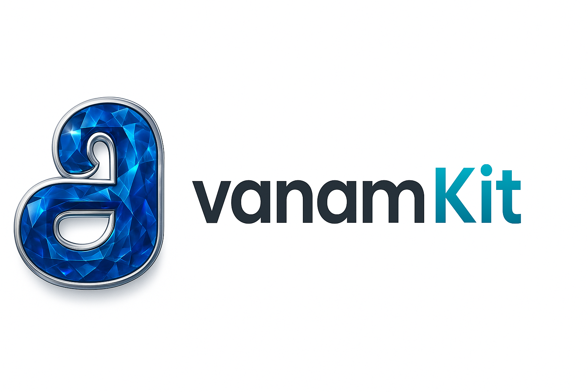

<div align="center">
  <br />
  <p>
    
  </p>
  <h1 align="center">AavanamKit</h1>
  <p align="center">
    The open-source document generation ecosystem that gives the design power back to your users.
    <br />
    <a href="https://aavanamkit-demo.vercel.app/"><strong>Explore the Live Demo »</strong></a>
    <br />
    <br />
    <a href="https://github.com/jafranjemal/aavanamkit/issues">Report Bug</a>
    ·
    <a href="https://github.com/jafranjemal/aavanamkit/issues">Request Feature</a>
  </p>
</div>

[](https://opensource.org/licenses/MIT) 
[](https://github.com/jafranjemal/aavanamkit/actions/workflows/engine-ci.yml)
[](https://github.com/jafranjemal/aavanamkit)
[](https://www.npmjs.com/package/@aavanamkit/designer)
[](https://www.npmjs.com/package/@aavanamkit/designer)

## The Endless Cycle We All Hate

Let's be honest. You've been there. You build a beautiful application, and then comes the request: "We need to generate invoices as PDFs."

So you do it. You fight with a clunky library, you spend hours tweaking print CSS, and finally, it's done. A week later, the email arrives:

> *"Hey, this is great! Quick change: can we move the logo to the right, make the 'Total' bold, and add our new company slogan to the footer?"*

Suddenly, you're not a software engineer anymore. You're a report designer, trapped in an endless cycle of minor layout changes, redeployments, and billing for tedious work.

**This is a massive industry gap.** We build dynamic, user-driven applications, but our documents remain rigid, hardcoded, and a pain to maintain.

## AavanamKit is the Solution.

**AavanamKit** is a complete ecosystem built to solve this problem once and for all. We believe developers should build systems, not documents.

Our solution is simple: **We give the design power to your users.**

Instead of building a static invoice, you embed our powerful visual designer into your application. Your users—the shop manager, the accountant, the admin—can create, edit, and manage their own document templates with a drag-and-drop interface. They change the logo. They add the slogan. They update the terms.

You build the tool once, and you are **free**.

---
## 🚀 Live Demo & Documentation

Seeing is believing. We've built a full live demo and a comprehensive documentation site.

* **[ &raquo; Try the Live Demo Now! ](https://aavanamkit-demo.vercel.app/)**
* **[ &raquo; Read the Official Docs ](https://aavanamkit-docs.vercel.app/)**

The demo comes pre-loaded with a gallery of professional templates. The complete source code for these templates can be found in the [`packages/designer/src/lib/templates.js`](./packages/designer/src/lib/templates.js) file.

---
## ✨ The AavanamKit Ecosystem

AavanamKit is a monorepo containing two distinct but perfectly synchronized packages:

### 🎨 `@aavanamkit/designer` (The Frontend Studio)
A powerful, embeddable **React component** that provides a full WYSIWYG "design studio" for your users. It's the visual heart of the system.

- **Visual Canvas:** Drag, drop, resize, and style every element.
- **Data Binding:** Your users can link design elements directly to your application's data schema.
- **Advanced Components:** Includes a powerful, auto-paginating table that just works.

**[ &raquo; Learn more about the Designer ](./packages/designer/README.md)**

### ⚙️ `@aavanamkit/engine` (The Backend Powerhouse)
A pure, **headless Node.js library** with zero browser dependencies. It takes the templates created by the designer, merges them with your live data, and generates pixel-perfect documents on your server.

- **Multi-Format:** Generate **PDF**, **DOCX**, and **HTML** from the same template.
- **Automated:** Perfect for API responses, scheduled jobs, or sending email attachments.
- **Robust:** Intelligently handles missing template properties to prevent crashes.

**[ &raquo; Learn more about the Engine ](./packages/engine/README.md)**

---
## 📦 Quick Start: A Complete Example

Here's a quick overview of the end-to-end workflow.

### Step 1: Define Your Data Schema
In your application, define the structure of the data you want to use in your documents.

```javascript
// This is the data structure of YOUR application.
const myAppSchema = {
  customer: { name: "string", address: "string" },
  invoiceNumber: "string",
  items: [{ description: "string", total: "number" }]
};

Step 2: Embed the Designer
Use the @aavanamkit/designer component in your admin panel, passing it your schema. Your users can now create and save templates.

// Your user-facing template editor page
import AavanamKit from '@aavanamkit/designer';
import '@aavanamkit/designer/dist/style.css';

function TemplateEditor({ schema, onSave }) {
  return (
    <AavanamKit
      schema={schema}
      onSave={onSave} // Your function to save the template JSON to your DB
    />
  );
}

Step 3: Generate Documents on Your Server
When a user wants to download a real invoice, use the @aavanamkit/engine on your backend.

// Your backend API route (e.g., in an Express.js app)
import { generate } from '@aavanamkit/engine';

app.get('/api/invoices/:id/download', async (req, res) => {
  // 1. Fetch the saved template from your database
  const template = await db.templates.findOne(...);
  
  // 2. Fetch the live data for this specific invoice
  const liveData = await db.invoices.findOne({ id: req.params.id });

  // 3. Generate the PDF buffer
  const pdfBuffer = await generate({
    template: template.templateData,
    data: liveData,
    outputType: 'pdf'
  });

  // 4. Send the file to the user
  res.setHeader('Content-Type', 'application/pdf');
  res.send(pdfBuffer);
});

Contributing
The AavanamKit Project is a community-driven, open-source initiative and we welcome contributions of all kinds. This project exists to save developers time